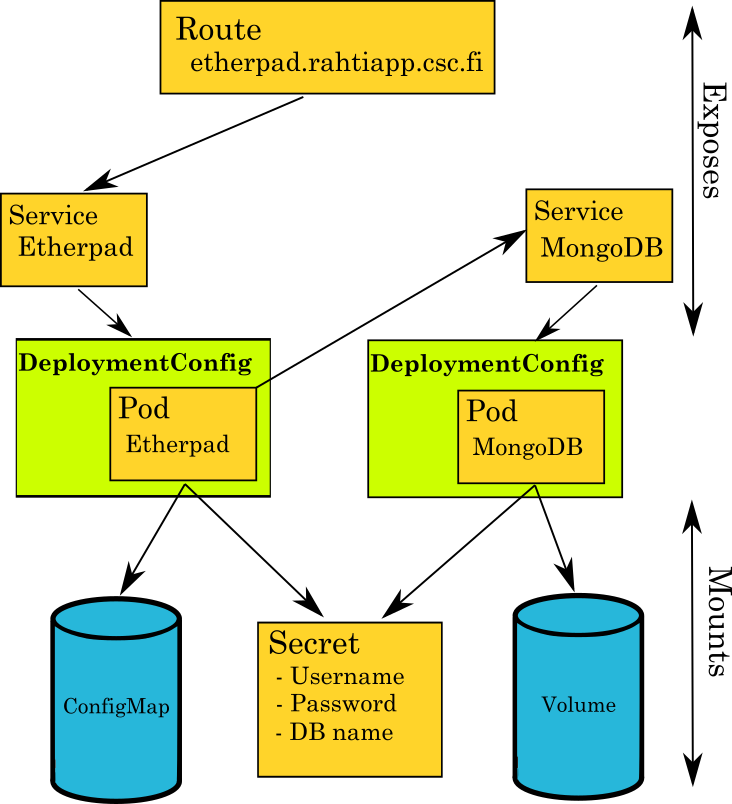

# OpenShift Template example with Etherpad

- [OpenShift Template example with Etherpad](#openshift-template-example-with-etherpad)
  - [Introduction](#introduction)
  - [Usage](#usage)
    - [From the command line](#from-the-command-line)
        - [Tweak the deployment](#tweak-the-deployment)
    - [From the web interface](#from-the-web-interface)


This directory contains YAML definitions for an example OpenShift Template which
deploys a shared notepad application using [Etherpad](https://etherpad.org/). 
Here is a short description for each of the files:

* **container-src/Dockerfile**: The Dockerfile which has been used to build the Etherpad
docker image.
* **container-src/entrypoint.sh**: Initialization script for Etherpad which takes environment 
variables and use them to configure the settings.
* **container-src/settings.json**: Etherpad's configuration file.
* **etherpad-template.yaml**: the YAML definition for the OpenShift template.

## Introduction

A template describes a set of objects that can be parameterized and processed to 
produce a list of objects for creation by OpenShift. A template can be processed to create 
anything you have permission to create within a project, for example services, build 
configurations, and deployment configurations. A template may also define a set of 
labels to apply to every object defined in the template.

This particular template example contains the following object types:

* **ConfigMap**: A Kubernetes object that contains configuration data and that can 
be passed to containers as files or environmental variables.
* **Secret**: A Kubernetes object similar to `ConfigMap` but with extended security features.
* **PersistentVolumeClaim**: A Kubernetes object that requests mapping from a storage 
cluster to a disk that can be mounted to containers as volumeMounts.
* **DeploymentConfig**: An OpenShift object which is comprised of one or multiple pods 
and manages their updates via changed images or updated configuration.
* **Pod**: A Kubernetes object that runs one or more containers. The smallest schedulable 
unit. Containers in the pod have a shared network stack.
* **Service**: A Kubernetes object that provides a stable network identity to `Pods` 
and performs load balancing between the different replicas.
* **Route**: An OpenShift object that exposes `Service` objects to the internet,
only for HTTP/HTTPS traffic.



## Usage

### From the command line

First, you should:

1. Clone this repository.
2. Change your shell's working directory to the `etherpad` directory.
3. Login to an OpenShift cluster using the `oc login` command. You can find
   instructions in the [Rahti documentation](https://rahti.csc.fi/usage/cli/).
4. Create a project in which to deploy the Job using `oc new-project`.

Then, you would need to create the Etherpad template:

```bash
oc create -f etherpad-template.yaml
```

Once you've created the Template, you can use it to deploy Etherpad:

```bash
oc process etherpad | oc create -f -
```

In a few minutes, Etherpad will be available using the URL from the output of the
following command:

```bash
oc get route etherpad -o=jsonpath='{.spec.host}'
```

#### Tweak the deployment

It's also possible to customize the deployment using the following variables:

* **NAME**: Name of the deployment, service, route...
* **ADMIN_PASSWORD**: Etherpad's admin password for accessing 
http://<etherpad_url>/admin`
* **DB_NAME**: The name of the database to be created in MongoDB in order to store
Etherpad's data.
* **DB_USERNAME**: The username for accessing the MongoDB database.  
* **DB_PASSWORD**: The password for accessing the MongoDB database.  
* **DB_ADMIN_PASSWORD**: The password for accessing the MongoDB admin.
* **DB_PORT**:  The database port which will be exposed by MongoDB.

For a customized deployment, you should run:

```bash
oc process etherpad \
    -p NAME=hello-etherpad \
    -p ADMIN_PASSWORD=changeme \
    -p DB_NAME=etherpadDB \
    -p DB_USERNAME=etherpad-user \
    -p DB_PASSWORD=changeme \
    -p DB_PORT=27017 \
| oc create -f -
```

### From the web interface

1. Go to the [Rahti web interface](https://rahti.csc.fi:8443).
2. Select `CSC account` as the authentication method and login using your username
and password.
3. Create a new OpenShift project and then click on it.
4. From the project overview, click on `Browse catalog`.
5. On the top right corner, under `Add to Project`, click on `Import YAML / JSON`.
6. Click on `Browse` and then select the template file `etherpad-template.yaml` 
and click on create.
7. On the window prompt, make sure to uncheck `Process the template` and check
`Save template`.
8. After you refresh the page, you should see a new application in the catalog 
called `Etherpad`. You can click on it and follow the on-screen instructions until
you'll have your own Etherpad deployment up and running.
