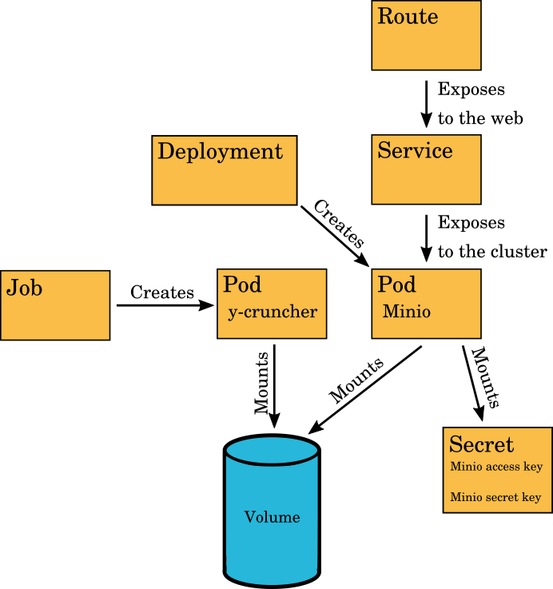

# OpenShift Job example with y-cruncher

- [OpenShift Job example with y-cruncher](#openshift-job-example-with-y-cruncher)
  - [Introduction](#introduction)
  - [Usage](#usage)
    - [From the command line](#from-the-command-line)
  - [Customizing job parameters](#customizing-job-parameters)
    - [y-cruncher-job.yml](#y-cruncher-jobyml)
    - [job-output-persistentvolumeclaim.yml](#job-output-persistentvolumeclaimyml)

This directory contains YAML definitions for an example OpenShift Job that
computes digits of pi using a program called
[y-cruncher](http://www.numberworld.org/y-cruncher/). Here is a short
description for the most important files:

- **Dockerfile**: this can be used to build a Ubuntu based Docker image that has
  y-cruncher installed.
- **y-cruncher-job.yml**: the YAML definition of the Job itself.
- **job-output-persistentvolumeclaim.yml**: the YAML definition for a persistent
  volume to store output data (in this case a text file containing digits of
  pi).
- **minio/minio-template.yml**: a template for a simple Minio object storage
  server to fetch the result from the Job.

## Introduction

A Job in OpenShift creates one or more Pods that are meant to execute a certain
task and then exit. It also has retry logic to ensure the tasks get executed
succesfully.

Persistent volumes provide storage that can be mounted in a pod under some
directory path. They can outlive the pod to which they are attached - hence the
word "persistent".

In this example we attach a persistent volume to a pod created by a job. Once
the job finishes we can safely delete it and its associated pods if we want and
the output data will remain on the volume. We can then make that data available
by attaching that same volume to a pod that runs a Minio object storage server
through which we can download the output data using a web browser.

There are different types of volumes that can be created. Here we create a
ReadWriteMany volume that can be mounted on multiple pods at the same time. This
means we could launch the object storage server while the job is running. If we
were to use a ReadWriteOnce volume instead, we would need to wait for the job to
finish before starting the object storage server. Whether a volume can be
mounted on multiple pods depends on the underlying storage - not all types of
storage implementations support this.

The Minio template contains a Deployment object that manages pods and ensures
that a given number (in our case one) of them are running and healthy. A Secret
object is used for storing the access and the secret keys for Minio and is
mounted as a special kind of volume. There are also Service and Route objects
for exposing Minio to the web.

For more information about the basic building block objects mentioned here, have
a look at the [Rahti documentation about Kubernetes and OpenShift
concepts](https://rahti.csc.fi/introduction/background/#kubernetes-and-openshift-concepts).

The OpenShift objects created in this example are illustrated in the picture
below:



In terms of how Jobs would be used in the real world this example is a bit
contrived and overly complicated. A simpler option compared to deploying a
dedicated Minio just to get output from one job instance would be to push output
from the job to a separate external object storage service like S3 or Swift
instead.

## Usage

### From the command line

First, you should:

1. Clone this repository.
2. Change your shell's working directory to the `pi-compute-job` directory.
3. Login to an OpenShift cluster using the `oc login` command. You can find
   instructions in the [Rahti documentation](https://rahti.csc.fi/usage/cli/).
4. Create a project in which to deploy the Job using `oc new-project`.

You can create the Job and its output volume like this:

```bash
cat *.yml | oc create -f -
```

Once you've created the Job, you can follow the progress of the computation by
following the logs that the Job outputs (if the Job has not yet started, try
executing the log command again):

```bash
oc logs -f job/pi-crunch
```

The Job writes its output on a persistent volume (defined in
`persistentvolumeclaim.yml`). You won't be able to access data on the volume
directly, so you will need to deploy a server to access its contents. There is
an example template included with this example for deploying the Minio object
storage server to serve the content of the volume.

You can deploy a Minio server like this:

```bash
oc process -f minio/minio-template.yml | oc create -f -
```

Once the server is up and running, you can get the URL of its web interface like
so:

```bash
oc get -o template route minio-route --template={{.spec.host}}
```

To login, you will also need an access key and a secret key for the Minio
server. These were automatically generated when you deployed Minio. You can get
the values for these keys with these commands:

```bash
echo -n "Minio access key: " && \
oc get secret minio-secret -o go-template='{{ .data.minioAccessKey | base64decode }}' && \
echo

echo -n "Minio secret key: " && \
oc get secret minio-secret -o go-template='{{ .data.minioSecretKey | base64decode }}' && \
echo
```

Go to the address of the Minio server in your browser and enter the access key
and the secret key. You should be presented with a web interface where you can
download the result from the job - a text file with a very precise value for pi.

## Customizing job parameters

Once you've tried the example once, you might want to have a look at some of the
parameters and how they can be customized. Here is a list of some of these
parameters that you can try to customize.

### y-cruncher-job.yml

This is the command used to launch y-cruncher. Here `50m` means 50 million digits and `-TD:2` means that we want to use two threads (see below for why that is the case):

```yaml
command:
  - /opt/y-cruncher/y-cruncher
  - bench
  - 50m
  - -TD:2
```

You could try a different number of digits to see how that affects computation
time and the size of the output file. Note that larger numbers may also require
substantially more memory.

This sets the amount of resources that we want to request for our job and what
we want to limit our job's maximum resource usage to:

```yaml
resources:
  limits:
    cpu: 2
    memory: 8Gi
  requests:
    cpu: 2
    memory: 4Gi
```

The request means the amount of resources the job is guaranteed to get, while
the limit means how much it can use at most. Should the job exceed its memory
limit, it will be terminated by the out-of-memory killer in Linux.

Note that we are reserving 2 virtual cores here. This corresponds with the
number of threads we selected in y-cruncher's parameters. Generally it is most
efficient to use an equal number of threads as we have cores available. Should
you want to allocate more cores to make the computation faster, you should also
change the number of threads accordingly.

### job-output-persistentvolumeclaim.yml

The volume definition is pretty simple. You mainly just specify an access mode
and a size for the volume.

This sets the size of the volume. Here we allocate two gibibytes:

```yaml
resources:
  requests:
    storage: 2Gi
```

If you wanted to calculate a much larger number of digits, you would need to
allocate a bigger volume here.
